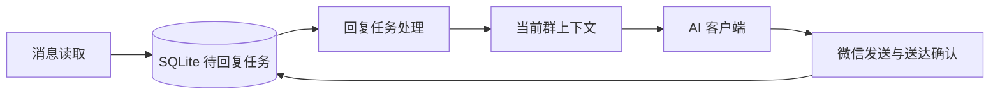

# 微信机器人架构评估

本次已实现的范围是快照关闭、按页解密、跳过未变化的数据库扫描。下面的架构调整是讨论建议，尚未实施。

## 当前判断

数据库读取、SQLite 待回复队列、AI 客户端和 UI 脚本已有初步分工。群隔离、真实 @ 判断、发送前路由校验和发送后数据库确认值得保留。主要问题是 `Bot` 同时处理大量 SQL、历史上下文、模型工具和桌面发送流程，修改一个流程需要理解较多底层细节；同步的模型请求也会延迟下一轮收消息。

本次内存优化未使用设计模式：直接实现更简单。一个负责关闭的快照连接类型、按页读取函数和有界的文件版本记录已经足够，无需再增加缓存代理或通用仓储框架。

## 下一步适合讨论的边界

| 职责 | 对上层提供什么 | 内部拥有的细节 |
| --- | --- | --- |
| 消息读取 | 群列表、增量消息、指定群历史、送达查询 | SQLCipher、WAL、一致性校验、SQL 和连接生命周期 |
| 上下文构建 | 当前群的模型输入 | 摘要、预算、昵称、图片和成员记忆的选择 |
| 回复任务处理 | 推进一条持久化任务 | 模型调用、错误处理、任务状态迁移 |
| 微信发送 | 向已核实的群发送并返回明确结果 | X11、DPI、搜索选择、草稿检查和送达确认 |

这里适合 Adapter / 适配器：把微信数据库与桌面接口转换为业务需要的操作，避免 SQL、X11 几何和子进程错误继续散布到回复流程。已有多个实际调用位置，且能够用假的读取器和发送器测试业务流程。先抽出小型模块或类；接口和工厂只在出现真实的多实现需求时增加。现有 `AIClient` 已起到类似边界作用。

## 收消息和生成回复可以分开执行

生产者/消费者适合解决当前明确存在的问题：模型请求慢时，仍然持续收取新消息。可以保持一个进程，一个采集任务和一个回复任务，复用已有 SQLite 队列；队列只保存有界任务数据，历史按需读取。两个执行者各自拥有数据库连接，所有桌面操作必须串行，包括原生表情操作。并发会增加同时活跃的内存，实施时需要重新测量和设定上限。

## 状态与事件的取舍

发送已经有持久化状态，包括 pending、ready、sending、submitted、confirmed、delivery_uncertain 和 expired。建议先集中管理允许的状态迁移，明确失败、重试和恢复规则。当前不需要为每个状态创建一个 State 类。

暂时没有必要加入 Observer / 发布订阅或 Strategy / 策略：回复流程需要明确顺序和结果，而现有需求没有多套可互换算法。增加这些抽象会使错误处理和追踪更复杂。

优先讨论读取和发送的适配边界，再决定是否将采集与回复解耦。桌面发送仍是单一、脆弱的外部资源；无论如何拆分，都必须保留歧义时停止发送、发送不确定时不自动重发的规则。
