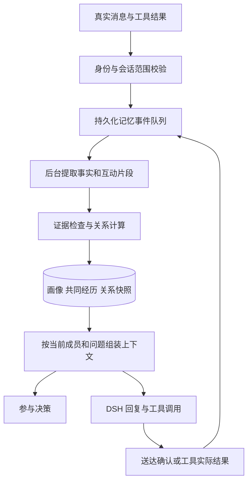

# 成员画像与关系记忆方案

调研日期：2026-09-10。状态：设计提案，尚未实现或部署。本方案中的分值、时间窗口、预算和验收阈值是待评测的产品参数，不是心理学定律或实测结果。

建议将现有 SocialMemory 升级为独立的成员记忆模块，提供身份识别、画像事实、共同经历、关系状态、授权范围内的检索与记忆管理。保留现有 DSH 推理和消息队列，不另建聊天 agent。关系记忆属于基础架构，不属于某一个人设或活动 skill。

## 1. 现有实现与缺口

已检查本地 social_memory.py、bot.py、participation_decision.py、background_knowledge.py 和配置；本次未重新核验服务器运行状态。

现有模块按会话和成员哈希隔离，以 SQLite 保存待处理事件、以 Markdown 内的 JSON 保存画像。只提取本人自述及有多条证据的交流观察；有查看、删除、停记、恢复能力，并会检查异步提取期间是否发生删除。回复前会载入当前提问者与最多三位相关成员的资料。

主要缺口：

| 缺口 | 当前影响 | 改进 |
|---|---|---|
| 四个固定槽位、每人最多四条 | 多个兴趣或偏好互相覆盖 | 原子事实集合＋按需生成的精简画像 |
| 只有 updated，没有事实有效期 | 旧职业、过时偏好难以正确解释 | recorded_at 与 valid_from/valid_to 分开 |
| 证据事件处理后从队列删除 | 长期复核和重算缺少完整证据链 | 独立保留有期限的最小证据与来源指针 |
| 更新以队列和文件分别落盘 | 画像与任务进度无法一个事务提交 | SQLite 中统一提交，文件只做导出 |
| 没有共同经历和关系状态 | 知道用户兴趣，但相处方式没有连续性 | 互动片段、关系事件、关系快照 |
| 主要学习用户文本 | 不能可靠表示双方完成过什么 | 接收确认送达、工具成功和活动结束事件 |
| 参与决策没有画像输入 | 生成层懂偏好，决策层仍不了解该不该接话 | 同一份精简关系上下文供两层使用 |
| 查看/删除命令是固定文本映射 | 自然说法不一定识别 | 主体绑定的记忆管理工具＋明确命令快捷处理 |
| 私聊沿用部分群聊措辞 | 画像解释和管理回执不贴合场景 | conversation_type 贯穿上下文与回执 |

## 2. 调研依据与取舍

| 来源 | 可借鉴机制 | 本项目取舍 |
|---|---|---|
| [LangGraph memory](https://docs.langchain.com/oss/python/concepts/memory) | 画像与事实集合、语义/经历记忆、同步与后台写入、namespace | 精简画像常驻，完整事实与经历按需取；不迁移运行框架 |
| [Letta memory blocks](https://docs.letta.com/tutorials/attaching-detaching-blocks/) | 按需附加的持久上下文块 | 当前成员核心偏好与关系简报常驻，不塞入整本档案 |
| [Mem0 2026-04 更新](https://mem0.ai/blog/mem0-the-token-efficient-memory-algorithm) | 追加事实保留演变、实体关联、多信号检索 | 不再直接覆盖旧事实；同时维护“当前有效事实”视图，避免新旧事实并存时答错 |
| [Graphiti](https://github.com/getzep/graphiti) | 事实有效期、记录时间、失效与历史保留、实体检索 | 学习时间语义；第一版不引入图数据库 |
| [Hindsight](https://arxiv.org/abs/2512.12818) | 区分事实、经历、汇总和可变看法；retain/recall/reflect | 好感是有依据、可修正的关系状态，不能写成用户客观属性 |
| [Generative Agents](https://arxiv.org/abs/2304.03442) | 记录经历、反思、检索后参与行为规划 | 保存有意义的共同经历，既影响回复也影响参与决策 |
| [MemoryBank](https://arxiv.org/abs/2305.10250) | 随时间和重要性遗忘、强化记忆 | 不同类型不同衰减；不把遗忘曲线生硬当作好感衰减公式 |
| [LongMemEval](https://arxiv.org/abs/2410.10813) 与 [EverMemBench](https://arxiv.org/abs/2602.01313) | 更新、时间、多轮推理、拒绝无依据回答；多人归属和画像理解 | 建立中文多群＋私聊轨迹评测，而不只测是否记得某个词 |

Mem0 官方说明其最新公布分数包含托管平台的专有优化，不能承诺开源接入能复现相同分数。Hindsight、Graphiti 的文档和代码表明它们有自己的存储与服务依赖；是否采用应基于本项目部署和中文测评，而非排行榜。[Mem0 说明](https://github.com/mem0ai/mem0)、[Hindsight 部署](https://github.com/vectorize-io/hindsight)、[Graphiti 安装](https://github.com/getzep/graphiti#installation)。

这些资料支持记忆的组织和检索方式，并没有为本项目提供已经验证的“好感度公式”。以下关系机制是工程设计，需要独立做行为评测。

## 3. 好感、熟悉程度与边界分开

推荐至少维护：

| 状态 | 含义 | 起点与变化 |
|---|---|---|
| familiarity 0–100 | 累积相处与了解程度 | 0 表示刚认识；由多次有效互动、不同活跃日和共同经历缓慢增加 |
| affinity 0–100 | 当前相处的亲和倾向 | 50 中性；受有依据的正负互动影响，不按消息数或夸奖次数直接累加 |
| interaction_state | 平稳、刚发生摩擦、修复中等近期气氛 | 短期状态，与长期关系分开，按时间或后续澄清恢复 |
| boundaries | 称呼、互怼、主动联系、特定话题的明确偏好 | 确认后立即生效，不由分数解锁或覆盖 |
| confidence/evidence | 对上述判断的证据强度 | 低证据时按中性相处；模型的自评分不是已校准概率 |

这允许表示“很熟，但今天不适合开玩笑”，也能表示“刚认识，聊得很愉快”。低好感不降低帮助质量，高好感不提高权限或事实可信度。不要把好感做成讨好、服从、赞助或泄露信息的奖励。

关系键默认是 `(account_id, persona_id, conversation_id, member_id)`。人设使用稳定配置 ID，不用可变昵称作为 ID。修改口吻或昵称不清空关系；显式更换身份时决定是否新建关系。微信好友状态只表示联系人资格，独立于熟悉程度。

### 关系更新

按“互动片段”而非单条消息计分：一段连续聊天或一次共同活动最多计一个主要事件。后台模型只提出事件类别、参与双方、证据引用及不确定性；确定性的 reducer 校验后更新状态，不开放 set_affinity 工具。

建议的初始规则：

| 事件 | 处理 |
|---|---|
| 有内容且有来回的交流 | 熟悉度小幅增加；普通中性讨论不必增加好感 |
| 多日持续互动、共同完成活动 | 提升熟悉度；有明确积极反馈时小幅增加亲和 |
| 重复问候、连续刷屏、反复夸机器人 | 合并、去重、收益递减；不能一天刷成老朋友 |
| 理性反驳、纠正错误、拒绝建议 | 不扣好感；明确纠正应改善事实，不惩罚反馈 |
| 真实持续的人身攻击 | 有清楚指向和上下文才记摩擦；不能只凭脏字匹配 |
| 表示“不喜欢这个称呼” | 立即设置边界，不扣好感 |
| 误解得到解释、道歉被接受 | 结束或减弱摩擦；不是负面事件永久累加 |
| 用户长时间没说话 | 不视为拒绝；只降低近期互动活跃度 |
| 机器人主动说了很多话 | 不能自己给自己积累关系；对方确有回应才构成双方互动 |
| 别人声称某人讨厌机器人 | 不更新该人的态度 |

原型参数可设每片段熟悉度最多 +2、每日最多 +4；亲和每片段变化不超过 ±2，每日总变化幅度封顶 6。达到熟人等级还要求跨多个活跃日，不只达到分数。参数需要通过加速回放校准，不能直接称为最终规则。短期摩擦可以在 24–72 小时后降权；长期共同经历不会因几周未联系而归零。

建议熟悉度分段：0–19 初识、20–49 熟悉中、50–79 熟人、80–100 老朋友。采用阈值滞后和跨日条件避免频繁跳级。分段控制可用称呼与共同梗的自然程度；好感和近期气氛再调节热情、调侃幅度。任何阶段都服从明确边界和当前语境。

## 4. 用户画像和共同经历

画像保存多条原子事实，例如称呼、回复长短、技术水平的明确自述、兴趣、用户希望跟进的项目。避免给人贴 MBTI、性格或动机标签。今天的情绪通常只进短期上下文；敏感私人信息继续按现有约束处理，不为了关系评分扩大采集。

每条事实至少包含：`subject_id, scope, predicate, value, kind, confidence_band, source_refs, recorded_at, valid_from, valid_to, status, supersedes`。

例如“我现在做后端了，以前做前端”：保存两个有时间含义的事实。当前画像展示后端，问到过去才召回前端；没有具体转换日期时保留日期未知，不能把消息日期伪装为实际入职日期。明确纠正、实际状态变化和多值并存分别处理；两个兴趣不互相覆盖。无法判定冲突时保留待确认状态，不以“最新一句话”无条件覆盖。

共同经历保存简短片段，例如“一起完成某次活动”“讨论过某个难题”，带参与者、会话、时间和结果。机器人说“已完成”不是证据：发送依据 confirmed，任务依据工具实际结果，游戏结果依据活动状态。未知送达不能被写成双方共同经历。

世界知识、蒋丞背景卡、用户画像、双方互动经历是不同的来源类型。蒋丞背景中的顾飞关系不能成为某位微信用户的画像或好感初始化依据。

## 5. 身份识别与可见范围

同一个微信账号可用稳定 ID 在内部识别；改昵称不丢画像，同名不同人不合并。但“知道是同一账号”不等于可以在任意场合使用全部资料。

默认保持现有隔离：群 A、群 B、私聊的事实、共同经历和关系状态各自独立。尤其不同人设不能互相继承亲密关系。同一用户在私聊说的事，不自动出现在群聊；从私聊推导出的关系等级也不跨群使用，避免用衍生数据绕过隔离。

预留显式共享机制：本人可以要求将称呼、回复偏好等指定字段用于其他会话。共享范围记录在字段上；不把整份档案自动全局化。第一版不默认开启共享。

## 6. 读写链路与接口



模块 API 建议为 `observe(event)`、`context(scope, actor, query, budget)`、`recall(scope, query)`、`manage(scope, actor, operation)`。宿主绑定 scope 和 actor，模型不能指定任意账号、文件或数据库。先只实现一个 MemoryService 小类，内部使用普通函数和数据对象；未使用设计模式：直接实现更简单。

回复前只做有预算的本地读取。称呼、边界、关系描述、少量相关画像常驻；完整经历按需检索。后台在互动片段结束后处理，例如安静约 60 秒，或达到 20 条未处理消息/等待 10 分钟；具体频率通过成本与延迟测评调整。显式的停记、删除、边界设置优先处理，不等普通批次；慢提取任务返回时必须检查删除版本。

工具建议：

| 工具 | 用途与权限 |
|---|---|
| recall_memory(query, kind) | 只读检索当前会话可见的画像与经历；默认当前成员，涉及其他成员需宿主根据当前会话解析；不返回其私聊档案 |
| manage_memory(action, description) | 本人查看、纠正、删除、停记、恢复自己的记忆；自然语言定位，不向用户索要内部 ID |

不开放通用 SQL、文件写入或任意好感值修改。维护者可通过管理界面查看分数变化与证据，但聊天模型默认只得到自然语言关系描述，不得到原始分数、内部 ID 或待处理状态。

### 在模型输入中的位置

system 固定保留记忆使用与隔离规则；宿主根据数值生成可信行为指引。用户原话、画像内容和经历摘要作为带来源的低优先级资料，不提升成 system 指令。

示例是说明结构，不是当前用户的真实档案：

```text
关系指引：你与当前成员已经熟悉，相处轻松。可以自然接梗，别生硬介绍自己。
明确边界：只用“小林”这个称呼；不要开外貌玩笑。
本轮相关资料：对方明确偏好简短解释；此前一起讨论过一个数据库问题。
使用要求：只在当前话题相关时提起往事；资料中没有的事情不补造。
```

对“今天累死了”的反应可以从初识时的“今天事情很多？”变成熟悉后的“行，今天先歇会儿。想吐槽就说。”变化应体现在自然口吻和已有共同语境，而不是未经邀请的昵称、强行追问或展示积分。

参与决策也消费同一份关系简报：熟悉的人可以更自然地接续话题，但不能因为某人分高就忽略别人的直接求助。群里发起话题需满足当前话题、最近互动与主动联系偏好；不把好感映射成发消息概率。私聊仍默认只响应新消息，不自动新增主动私聊功能。

## 7. 存储、检索和可靠性

SQLite WAL 为主存储，保持一个有界后台写入器。核心表建议：identities、memory_events、facts、episodes、relationship_events、relationship_state、memory_controls；画像是事实的当前视图。必要的索引放在 scope、subject、时间和状态上。

消息扫描写入 outbox 与游标推进同事务；记忆消费者按来源 ID 幂等处理。提取在事务外运行，提交时检查版本；事实、关系事件、快照和消费进度同事务提交。删除操作递增主体版本并清除派生数据、缓存、FTS 条目及待处理事件，迟到任务不能复活删除内容。审计保留无正文的操作记录，受控备份遵守删除与保留期限。

关系事件保留 reducer_version，可针对同一证据重新计算和对照参数；管理删除优先于追加历史原则。共享经历涉及多人时需按可见范围拆分或在删除请求后重新生成，不能留下已删除成员的原文。

第一版采用身份/时间/类型过滤＋中文 FTS＋实体/别称扩展，不引入常驻 embedding 模型或向量库。画像多数可按主体直接命中；经历语义召回是需要单独评测的不足，预留语义检索接口。当中文隐式查询测评不达标时，再用同一数据集评估轻量 embedding 或外部检索服务，不能用“已经有关键词检索”代替质量要求。任何外部服务不默认接收整段私聊。

建议预算：普通回复附加 500–1000 tokens，决策层 150–300 tokens；按需回忆最多两次，总额受原有上下文预算限制。明确边界与当前身份不能被压缩掉，先裁剪非必要经历。工程验收目标可先设本地读取 p95 <30ms、额外常驻 RSS <50MiB、无消息时不调用模型；都需在部署机器实测，而非当前承诺。

## 8. 验收与上线

先制作约 100 条中文轨迹、每条跨多轮/多天，覆盖多人群聊、私聊、不同人设、昵称变化、纠正偏好、反讽与友好互怼、误解后修复、刷分、长期未联系和删除期间后台任务返回。用固定 DeepSeek/DSH 配置比较三个版本：当前 SocialMemory、画像与经历版、加入关系状态版。

建议发布门槛：

| 类别 | 初始验收目标 |
|---|---|
| 范围和身份 | 测试集跨会话泄漏、同名串人、分数绕过权限均为 0 |
| 画像 | 已确认事实精确率 ≥95%，明确纠正生效率 ≥95%，单独报告召回率 |
| 关系 | 刷屏不快速升级；理性反驳不扣分；友好互怼不误判敌意；长时间沉默不生成责备 |
| 表达 | 不报分、不谈画像流水线；不编造共同经历；当前情绪和明确边界优先 |
| 工程 | 重放不重复加分；并发不丢更新；删除后不复活；崩溃后队列恢复 |
| 效果 | 盲评比较自然程度、过度熟络、讨好倾向、参与时机；不能只用模型自评分 |
| 成本 | 每百轮额外模型调用、tokens、RSS、读取延迟和后台积压均留实测报告 |

实施顺序：先改存储与证据链并迁移现有画像；再加入关系 reducer、核心简报和两个工具；随后接入参与决策与送达/活动结果；最后以影子模式记录候选变更但不影响回复，人工抽检后逐会话启用。旧画像只能迁移为原有自述/观察，不能据此猜测过去的好感分。初始关系保持中性，只有具备证据的互动可以回填。

首轮范围包含完整关系闭环、用户画像、共同经历、查看纠正删除、隔离、指标和测评。跨会话共享、高维人物社交图、自动主动私聊不作为默认功能，也不以这些扩展阻塞基础能力上线。
